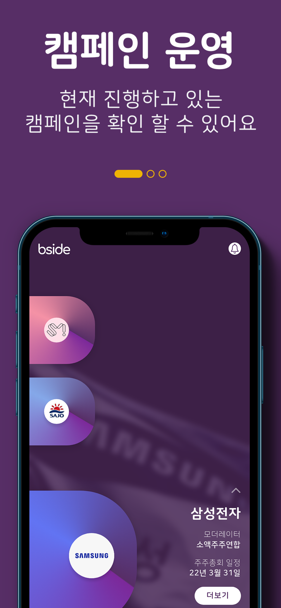
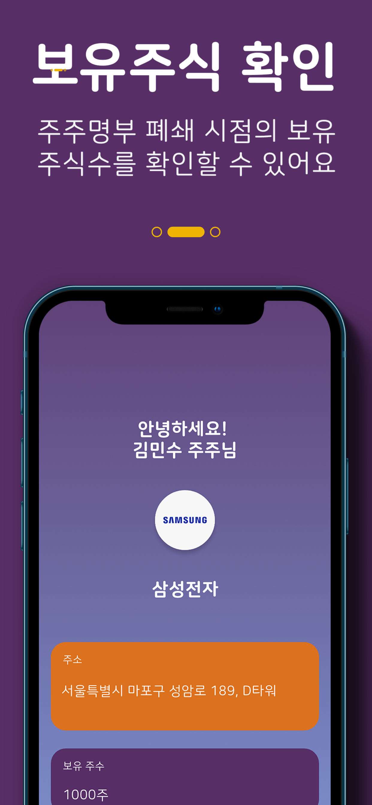
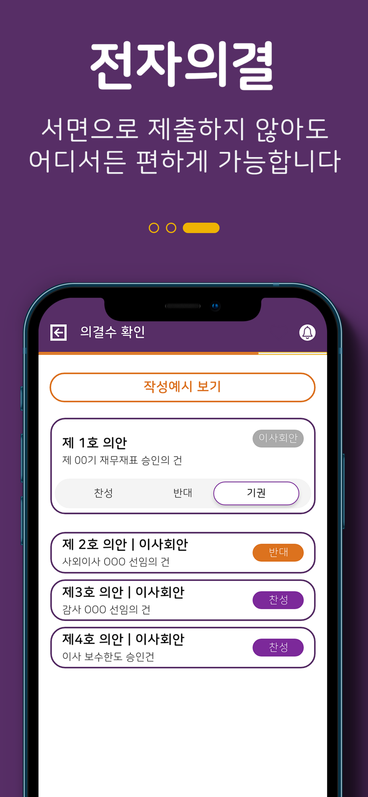

<p align="center">
  
  <h1 align="center">Bside Pie</h1>
</p>

비사이드 파이는 **인증된 소액주주들이 전문투자기관들과 함께 기업에 대해 심도 깊은 의견을 나누고 유용한 정보를 공유 하고 행동할 수 있는 앱**입니다. 비사이드 파이는 소액주주를 만나는 주요 창구로서, 비사이드가 구축하고자 하는 '주주인증, 결집 및 실행이 가능한 주주 행동주의 플랫폼'를 구성하는 핵심 서비스중 하나 입니다. MTS 기능으로 주주를 인증하고, 라운지로 결집시킨 뒤에 전자위임으로 행동하고자 합니다.

## Quick Start

### Requirements

- Flutter (>=3.0.x)
- .env
- android/key.properties
- android/upload-keystore.jks

### Scripts

```bash
# install
flutter pub get

# create .env
touch .env

# Run
flutter run
```

### App Screenshots

<p float="left">
  
   
  
</p>

## Tutorial

```bash
# run storybook
flutter run -t lib/main_dashbook.dart

# Set firebase
flutterfire configure

# deploy Android & iOS
flutter build appbundle && cd android && bundle exec fastlane beta & cd ..
cd ios && pod update && cd .. && flutter build ipa
flutter build ipa && cd ios && bundle exec fastlane beta & cd ..
nano ios/Runner.xcodeproj/project.pbxproj # ios version update

# Select xcode-beta
sudo xcode-select -s /Applications/Xcode-beta.app/Contents/Developer/

# Debug
flutter upgrade
flutter clean && flutter run

# import sorter
flutter pub run import_sorter:main
```

## Roadmap

1. 7월 초: 디자인 시스템 반영 후 서비스 출시 ()
2. 8월 중순: 디자인 시스템 완전 반영, 애니메이션 적용, 테스트 셋업 (8월 중순 목표)
3. 8월 말: 자동 테스트 및 배포 셋업 (8월 말 목표)
